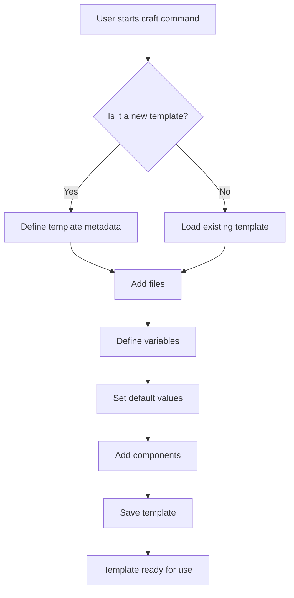
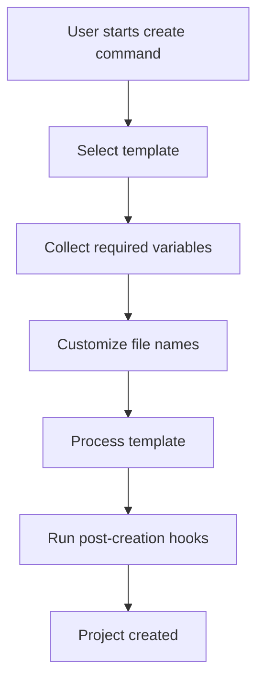
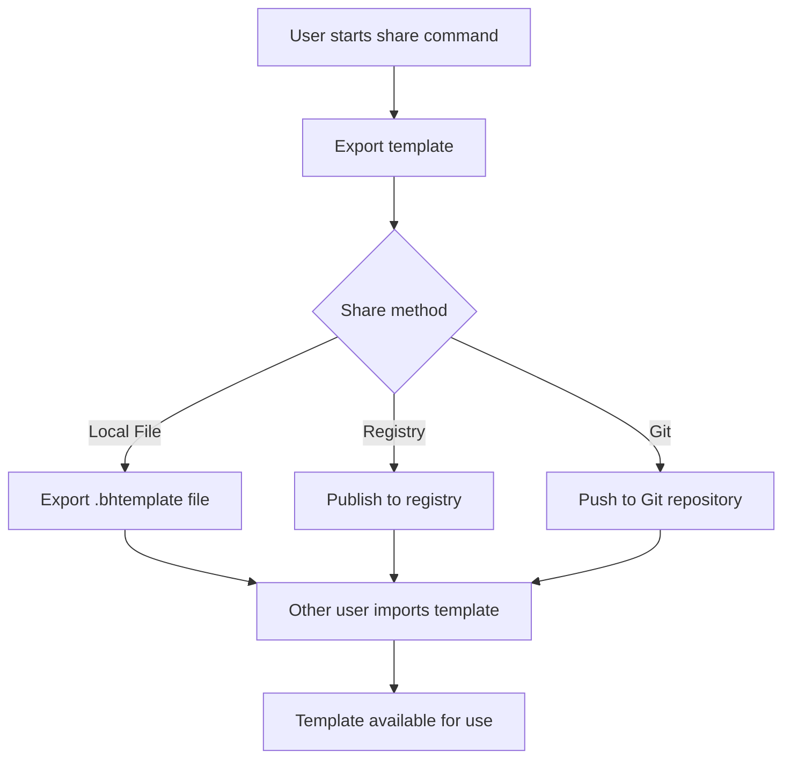

# BlueprintHub: Universal Project Template Manager

> A language-agnostic template engine for developers, researchers, and teams to craft, share, and use project templates.


## 🚀 Overview

BlueprintHub is a universal template manager that allows users to create, share, and use project templates across any programming language or framework. It solves the problem of project setup standardization without forcing users into rigid, language-specific workflows.

## ✨ Key Features

- **Universal Templates**: Create templates for any language, framework, or project type
- **Simple Usage**: One-command project generation with smart defaults
- **Flexible Structure**: No assumptions about what your project needs
- **Template Registry**: Discover and share templates with your team or community
- **Plugin System**: Extend functionality for specific languages and tools
- **File Name Templating**: Customize file names during project creation

## 🏗️ Architecture

BlueprintHub is built with a layered architecture to separate core functionality from language-specific features.

The heart of BlueprintHub is its ability to let you name files however you want when creating projects from templates. Here's how it works in simple terms: When someone creates a template, instead of hardcoding file names like "index.js" or "config.yaml", they can use placeholders like "{{main_file}}" or "{{config_name}}". These are like blank spaces in a form. Later, when someone uses that template to create a new project, BlueprintHub asks them what names they'd prefer for these files. Want to call your main file "app.js" instead of "index.js"? No problem! The system stores these flexible file names in a simple recipe card (the template manifest) that tells BlueprintHub which files can be renamed and what their default names should be if the person doesn't specify anything. Behind the scenes, BlueprintHub simply replaces all those placeholders with the actual names chosen before creating the files. It's like ordering a custom sandwich – the template is the menu, but you get to choose the specific ingredients you want.


The magic of BlueprintHub goes beyond just renaming files - it's also incredibly smart about handling project dependencies across any technology. When someone creates a template, they can specify what packages, libraries, or tools the project needs without being locked into just one ecosystem like Python or JavaScript. Instead of assuming every project uses pip or npm, BlueprintHub lets template creators tag dependencies by their package manager - so you might have some npm packages for frontend code, pip packages for Python scripts, and conda environments for data science work, all in the same template. When someone creates a new project, BlueprintHub automatically detects which package managers are needed and generates the right configuration files (like package.json or requirements.txt). It even runs the appropriate install commands after creating your project if you want. This means anyone can use the template regardless of their technical background - a bioinformatician can create a genomics pipeline template with specialized tools, and another researcher can use it without needing to know all the complex dependency details. It's like having a personal assistant who not only organizes your files but also installs all the right software for your specific type of project.


---

## 🔷 BlueprintHub: Powerfully Flexible Template Engine

### 🚀 What It Does (Short Summary)
BlueprintHub lets users create customizable, multi-language project templates with:
- 🔤 Dynamic file/folder names (`{{main_file}}`)
- 🧩 Ecosystem-specific dependency definitions (npm, pip, conda, etc.)
- ⚙️ Auto-generated config files (`pyproject.toml`, `package.json`, etc.)
- 📦 Auto-installs packages via CLI (opt-in)

---

## 📂 File Renaming (Smart Templating)

> Use `{{placeholders}}` in filenames and content. Get fully personalized projects.

**Example**:  
Template file → `src/{{main_file}}.js`  
Manifest →  
```yaml
variables:
  main_file:
    default: "index"
    prompt: "Enter your main JS file name"
```

### ⚙️ Internals:
- Files scanned and parsed using a **templating engine** (like Jinja2).
- All `{{var}}` replaced with user input during project creation.
- Final structure is created after substitution.

---

## 📦 Dependency Management (Modern, Multi-Ecosystem)

> Define dependencies across **npm**, **Python (via pyproject.toml)**, **conda**, and more.

### 🧪 Template Manifest Example:
```yaml
dependencies:
  npm:
    - react
    - vite
  python:
    build-system: ["setuptools", "wheel"]
    runtime: ["flask", "pandas"]
  conda:
    - biopython
```

### ⚙️ Internals:
- **npm**:
  - Auto-generates `package.json`
  - Runs `npm install` (optional)
- **Python**:
  - Generates `pyproject.toml` instead of `requirements.txt`:
    ```toml
    [build-system]
    requires = ["setuptools", "wheel"]

    [project]
    dependencies = ["flask", "pandas"]
    ```
  - Optional: runs `python -m pip install .` or `pip install -e .`
- **conda**:
  - Generates `environment.yml`
  - Optional: `conda env create -f environment.yml`

📦 You define once. BlueprintHub handles the rest.

---

## 🧠 How BlueprintHub Operates (Internally)

| Feature            | Mechanism                                                    |
|--------------------|--------------------------------------------------------------|
| Placeholder Replace| Jinja-style parsing + `manifest.yaml` driven substitutions   |
| Dependency Handling| YAML → programmatic config generation (TOML, JSON, YAML)     |
| Installer Runner   | Subprocess-based CLI calls (e.g., `npm install`, `pip`)      |
| Config Writers     | Uses AST/DSL generators for `pyproject.toml`, `package.json` |
| Template Engine    | Built in Python (extensible for Go, JS support too)          |

---

## 🧩 User Flow: Zero to Project

```bash
blueprinthub create my-app --from react-py-template
```

- Prompts:
  - "Enter main file name" → `app.js`
  - "Install dependencies?" → `yes`
- Result:
  - Project with renamed files
  - `package.json`, `pyproject.toml`, `environment.yml` generated
  - Dependencies installed


### Core Components

1. **Template Engine**: Manages template creation, rendering, and instantiation
2. **Registry Service**: Handles template discovery, storage, and sharing
3. **Plugin System**: Provides language-specific extensions
4. **User Interface**: CLI and potentially GUI tools for interaction

## 🔄 Workflow

### Template Creation Flow



### Project Creation Flow



### Template Sharing Flow



## 💾 Template Storage

Templates are stored in multiple locations depending on the use case:

1. **Local Storage**: `~/.blueprinthub/templates/` for user-created templates
2. **Registry Storage**: Cloud-based storage (S3/similar) for shared templates
3. **Git Integration**: Templates can be stored in Git repositories

### Template Manifest Structure

Each template is defined by a manifest file (`.template.yml`):

```yaml
name: genomics-pipeline
type: Bioinformatics Genomics Pipeline
author: dr.chen
description: Complete genomics analysis pipeline with Snakemake
version: 1.0.0

files:
  - source: Snakefile
    target: "{{ workflow_filename }}"
    default: "Snakefile"
  - source: environment.yml
    target: "{{ env_filename }}"
    default: "environment.yml"
  - source: config/config.yaml
    target: "config/{{ config_filename }}"
    default: "config.yaml"
  # Additional files...

variables:
  - name: project_name
    default: myproject
    description: Name of the project
  - name: workflow_filename
    default: Snakefile
    description: Name of the workflow file
  - name: env_filename
    default: environment.yml
    description: Name of the environment file
  # Additional variables...

dependencies:
  conda: [biopython, pandas, matplotlib]
  npm: []
  pip: []
  # Other package managers...

components:
  - Docker
  - Documentation
  - TestData

hooks:
  post_create:
    - conda env create -f "{{ env_filename }}"
    - git init
```

## 🔧 File Name Templating

BlueprintHub supports customizing file names during project creation:

### During Template Creation

```bash
$ blueprinthub craft
? Template name: web-project
? Project type: Frontend Web App
? Add files with variable names? Yes
> File 1 source name: index.js
> File 1 target name: {{ main_file }}
> Default value for main_file: index.js
```

### During Project Creation

```bash
$ blueprinthub create web-project
? Project name: my-website
? Main file name (index.js): app.js
```

The resulting project will have `app.js` instead of `index.js`.

## 📚 API Reference

### Command: `craft`

Create or modify templates.

```bash
blueprinthub craft [template_name]
```

### Command: `create`

Create a new project from a template.

```bash
blueprinthub create <template_name> [project_name] [--advanced] [--map-files]
```

### Command: `search`

Find templates in the registry.

```bash
blueprinthub search <query>
```

### Command: `share`

Share a template with others.

```bash
blueprinthub share <template_name> [--method=registry|file|git]
```

### Command: `import`

Import a template from a file or registry.

```bash
blueprinthub import <template_source>
```

## 🔌 Plugin System

BlueprintHub can be extended with plugins for specific languages or frameworks:

```bash
$ blueprinthub plugin install python
$ blueprinthub plugin install react
```

Plugins can provide:
- Language-specific templates
- Smart detection for project types
- Package manager integration
- Custom hooks and actions

## 🚀 Getting Started

### Installation

```bash
# Using pip
$ pip install blueprinthub

# Using npm
$ npm install -g blueprinthub

# Using homebrew
$ brew install blueprinthub
```

### Quick Start

```bash
# Create a template
$ blueprinthub craft my-template

# Create a project
$ blueprinthub create my-template my-project

# Share a template
$ blueprinthub share my-template
```

---